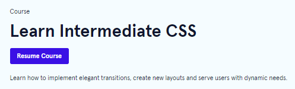
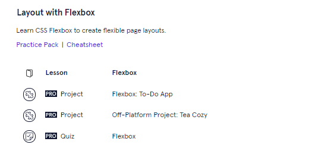
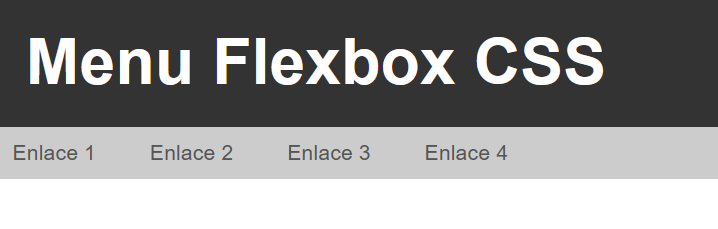
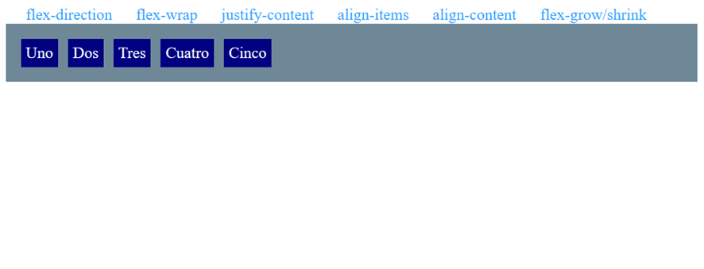

# Práctica 4.4 CSS Grid y Flexbox

## Parte 1

Finaliza el tutorial **Layout with Flexbox** de **Codecademy** de la parte de *Learn intermediate CSS.*   
      
  
      

 a. Captura la finalización de dicho módulo desde tu cuenta en el que se aprecie claramente que estás logueado con los datos de tu cuenta en la carpeta *parte1*

 b. Resuelve el ejercicio final (**Review**) y envía el código HTML y CSS resultante en la carpeta *parte1*

## Parte 2

Crea un **menú** sencillo en *Flexbox* **con tu propio estilo, diseño y enlaces** (no copies el que hay) con las siguientes condiciones: 
 
- Tendrá un título superior.
- El menú estará alineado a la izquierda.
- Permitirá *wrap* al redimensionarse.
- Tendrá al menos 4-5 enlaces. 

## Parte 3

Modifica y mejora el menú anterior que hayas creado con las siguientes mejoras: 

- Agrega la imagen de un logo a tu menú a la izquierda del todo.
- Modifica los colores y la fuente por defecto utilizada. 
- Implementa que el menú superior permanezca al hacer scroll (propiedad *fixed* o propiedad *sticky*), para lo cual deberás de agregar contenido de texto o una imagen central grande.
- Agrega varios **submenús** inventados a los enlaces propuestos
- Agrega al menos los siguientes elementos a uno de los submenús: 
    - Los de las propiedades de posicionamiento flex vistas: *justify-content, align-items, align-content, flex-grow/shrink/basis/order*. 
    - Implementa al menos **dos de ellas** mostrando cinco cajas en las que se muestre la propiedad aplicada que hayas seleccionado. 
    