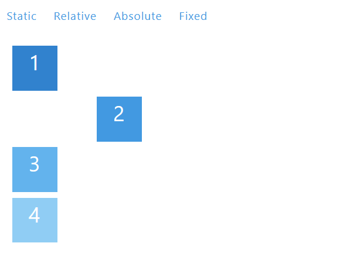

# Práctica 4.4 Posicionamiento en CSS

Desarrolla una sencilla página en HTML y CSS que cumpla las siguientes características:

-   Usa propiedades CSS adecuadas para cumplir con un diseño similar a de la captura inferior.
-   Deberá tener un menú superior de navegación con las siguientes opciones: *Static, Relative, Absolute, Fixed, Float.*
-   Al pulsar cada botón deberá mostrar 4 cajas de diferente color a las que se les aplique el *position* que se haya seleccionado en el menú superior.
-   Puedes usar una página por cada propiedad (o incluso usar *javascript* para hacerlo desde una sola página).

    
